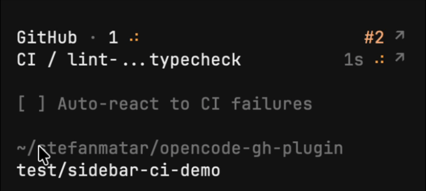

# opencode-gh-plugin

An [OpenCode](https://opencode.ai) TUI plugin that adds GitHub context to the session sidebar footer.

- **Session-scoped repo context** — resolves the repo from the viewed `session_id`, not the currently focused workspace
- **GitHub CI summary** — compact header with overall status plus pass/pending/fail/skip counts
- **Expandable checks list** — opens upward, keeps the header pinned to the bottom, and reserves the last row for `+N more`
- **PR link** — clickable PR number in the header, with check rows and overflow link-outs
- **Repo path and branch** — current session directory plus git branch at a glance
- **Middle-ellipsis labels** — long workflow/check names keep both the prefix and suffix visible
- **Live polling** — refreshes on session idle and branch changes while checks are pending



## Install

Point your OpenCode TUI plugin config at `sidebar-context.tsx`:

```json
{
  "plugin": [
    "/absolute/path/to/opencode-gh-plugin/sidebar-context.tsx"
  ]
}
```

Requirements:

- `gh` installed and authenticated
- `git` available in `PATH`
- the viewed session directory must still exist locally

Notes:

- The footer no longer shows session spend.
- PR and CI state are not stored in global KV anymore, so they do not leak across sessions.
- If `gh pr view` returns nothing for the session directory, the PR link is hidden.
